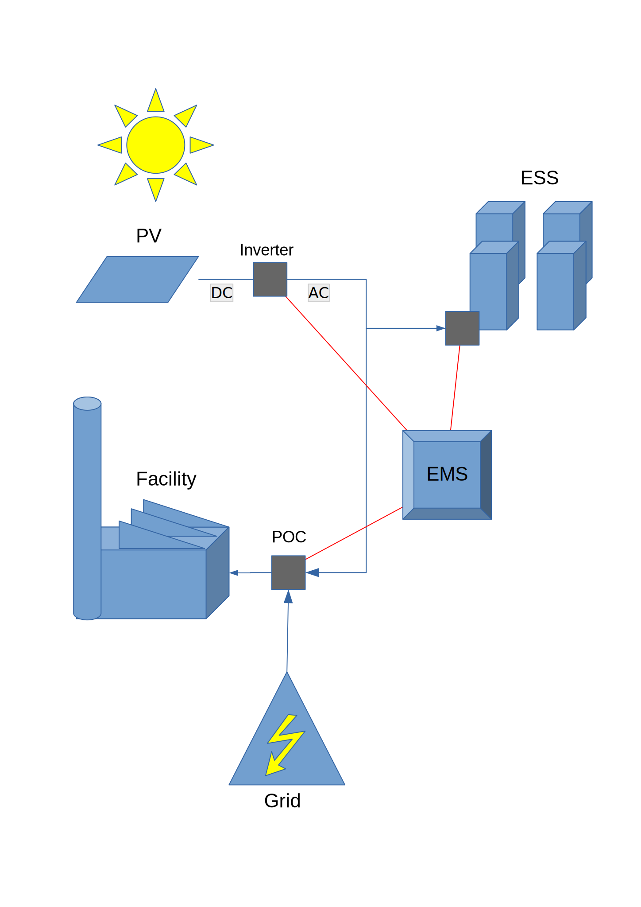
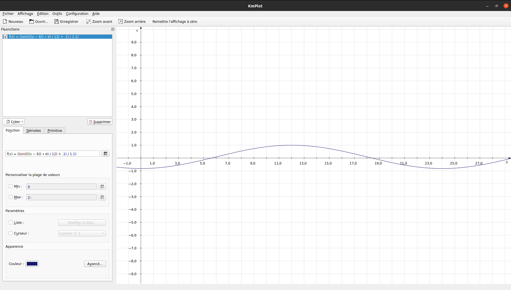
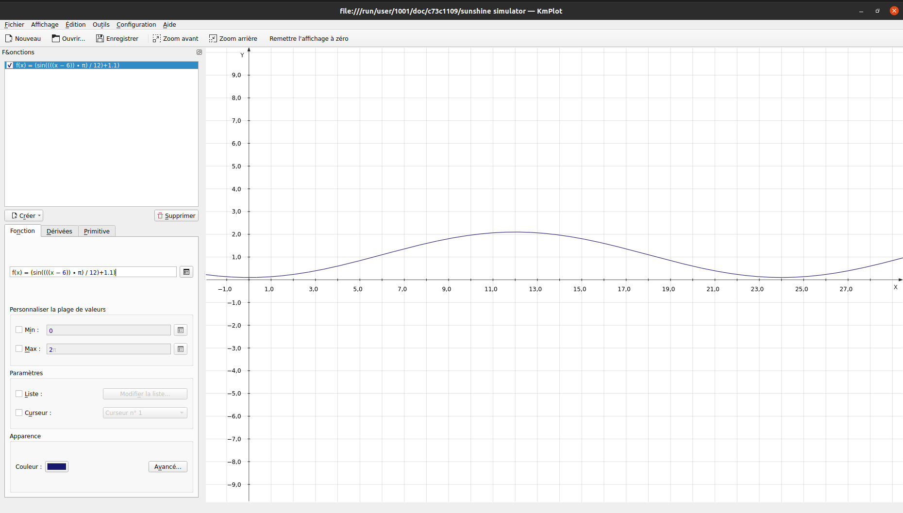

# EDF-S&F-Entry-Test
Job interview exercise, October 14 2021

## Problem description

You have to develop the core algorithm of an EMS that controls an industrial site smart grid.

On that smart grid are connected on a common AC bus:
- the industrial facility load
- an Energy Storage System (ESS, e.g. a battery) of capacity `ess_capacity` in kWh
- a photovoltaic (PV) power plant of peak power `pv_peak` in kW

The EMS can send power setpoint to the ESS (charge/discharge setpoint) and PV inverter (production limitation setpoint), and can read the meter at the point of connection (POC) between the industrial smart grid and the grid.

There is not direct metering of industrial facility consumption `Pload`, but it can be deduced.

At the point of connection (POC) with the grid, the meter measures `Ppoc` the power flowing from/to the grid. `Ppoc` is the resultant of smart grid productions and consumptions: `Ppoc = Pess + Ppv + Pload`, but remember that `Pload` is not directly available for the EMS).

The EMS objective is to ensure that the industrial site power consumption remains under a maximal value PmaxSite, and that not electricity is injected to the grid. This means `PmaxSite < Ppoc <= 0`

**Sign convention used**
- `P < 0` for power consumption
- `P > 0` for power production

* * *

## Variables description:

**ESS variables**
- Pess : current ESS active power output in kW (AC side) (< 0 means charge / > 0 means discharge )
- Pmaxch : current ESS maximal charge power capability in kW (AC side, necessarily <= 0 by convention)
- Pmaxdisch: current ESS maximal discharge power capability in kW (AC side, necessarily >= 0 by convention)
- Eess: current ESS stored energy in kWh (necessarily >= 0 by convention)
- setpointPEss: active power setpoint computed by the EMS in kW (AC side, <0 for charge setpoint, >0 for discharge setpoint)

**PV variables**
- Ppv: current PV inverter active power output in W (AC side, necessarily >= 0 by convention)
- Pprod: current PV production estimation from pyranometer in W (DC side)
- setpointPPv: PV inverter active power setpoint computed by the EMS in W (AC side, necessarily >= 0 by convention)

**POC meter variables**
- Ppoc: current active power measure at POC in kW (< 0 means smart grid draws power from the grid, > 0 means smart grid injects power to grid), expected to be `PmaxSite < Ppoc <= 0`

**Site load variables**
- Pload: current industrial site consumption in kW (<= 0 by convention)

**Constraints and expectations**
You have at your disposal a set of functions that return raw measures of the system (assume values directly comes from the equipments):
- `GetEssMeasure()` returns `Pess`, `Pmaxch`, `Pmaxdisch`, `Eess`
- `GetPvMeasure()` returns `Ppv`, `Pprod`
- `GetPocMeterMeasure()` returns `Ppoc` and you have a set of functions to send 

setpoints to equipment EMS can control:
- `SetEssSetpoint(setpointPEss)` sends `setpointPEss` to ESS
- `SetPvSetpoint(setpointPPv)` sends `setpointPPv` to PV inverter

You can use the development language of your choice.

Please note we do not focus on language syntax here, we also do not expect the code you write to be
executable, or having a program with hundred of lines. Also keep in mind that this is an open problem:
there is no expected solution.

The key point for us is trying to get an global idea on how do you address such a problem, how do you
present your code, on what details you choose to focus. So don’t hesitate:

- to add any comment that could help us to have a better understanding on what assumptions you
make
- to make use of functions that you do not implement, as long as you describe its interface and its
behavior

***

## Smart-Grid Sheme

## Environment

**Time**

Environment lib allows `GetHour()` and `NextHour()` to know the current time and add 1h to 24h time cycle. `GetHour()` is used in both sinusoids (sunshine and facility)

**Sunshine**

Sunshine is simulated using the sinusoid bellow and affected buy weather conditions. It is expressed in % (100% at 12h).

Actual `sunshine` is never at 100% due to weather conditions

**Weather**

Two weather variables are randomly set. This is usefull for PV simulation and affects sunshine. Both variables are expressed in % of best weather (a high value is sunny, a low value is cloudy)
- `dayWeather` is set at midnight every 24h. It defines the day's general weather (cloudy or sunny)
- `hourWeather` is set every hour and lowers the day's weather by a max factor of 20%

**Sunshine Sinusoid**

### Facility Simulator

**Facility Pload Sinusoid**

In code this value is negative since it is a consumption. The `Pload` changes every hour by a random factor but never shuts down to 0.

### Smart Grid And Components

Each component has a simulation function that allows to self manage power input or output depending on the setPoint configurations sent by the EMS, but also depending on real life physics.
- ESS can't charge over max capacity, can't discharge under 0, can't charge or discharge more than `PmaxCH` or `Pmaxdisch`
- PV can't output negative values

### EMS

The EMS is connected to all the smart grid components (ESS, PV and POC) and can perform production/demand limitations on all these components. It's AI can perform different strategies :
- 50-50%, will half the PV production to fill batteries and power the facility
- 100% ESS
- 100% POC

Mainly the EMS must obey this logic :
- 1: Charge ESS if PV produces more than needed
- 2: Limit PV output if ESS is fully charged and facility needs are satisfied